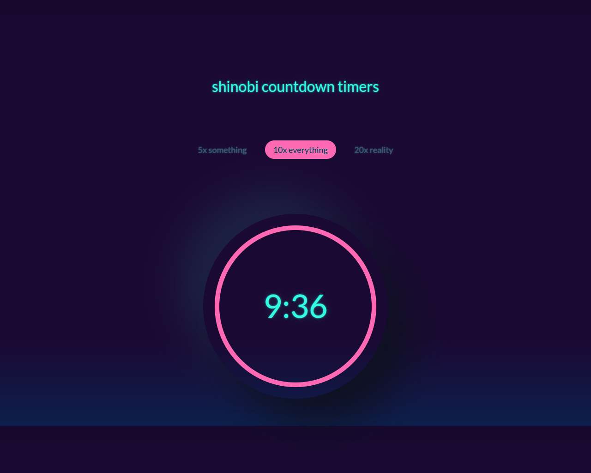

# get-ready

Get Ready is a free coming soon responsive HTML5 template that fits across multiple screen sizes.

This type of website is a great option for connecting your future customers with the awesome project you’re going to launch. The burger menu on the top-right corner comes with a full-width drawer navigation on-click. Moreover, the background slider makes the site more enthralling alongside the countdown timer. And, email subscription, as well as social media icons, allow users to connect more efficiently.

## Features

    Bootstrap Template
    Burger Menu
    Drawer Navigation
    Engaging Animtion
    Countdown Timer
    Email Subscription
    Social Media Icons
    Font Awesome
    Background Slider
    Fully Responsive
 
## In the box

    1 HTML File
    4 CSS Files
    7 Javascript Files
    Slider Images

## Credits

    Bootstrap v3.3.6
    jQuery v2.2.3
    FontAwesome 4.7.0
    Vegas
    themewagon.com/themes/free-coming-soon-responsive-html5-template/
    
## Conclusion

ThemeWagon offers you +300 free HTML5 templates to kickstart your project with ease and comfort. Let’s create a responsive website painlessly with a free bootstrap template. Furthermore, our quality checked section is ready to take your website to a whole new level of elegance with innovative design and incomparable functionality.

## See demo

go play with the app.

<a href="index.html">

Demo

</a>
