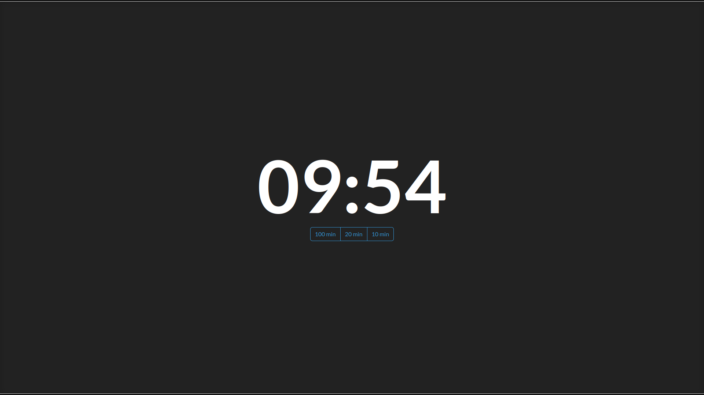

# Fullscreen Countdown & Count-up Timer

A simple, full-screen, and responsive countdown timer that starts counting up after reaching zero. Built with the Bootswatch 'Darkly' theme for a clean, modern look, it's perfect for focused work sessions, presentations, or any situation where you need a large, clear timer display.

## Features

- **Fullscreen Mode:** Automatically enters fullscreen when a timer is started for an immersive experience.
- **Responsive Design:** Looks great on both desktop and mobile devices, with a font size that adapts to your screen.
- **Countdown & Count-up:** Counts down from a preset time, plays an alarm, and then immediately starts counting up.
- **Clean 'Darkly' Theme:** Uses the 'Darkly' theme from Bootswatch for a sleek, modern interface.
- **Simple Controls:**
    - **Preset Times:** Quickly start a timer for 100, 20, or 10 minutes.
    - **Start/Pause/Reset:** Full control over the active timer.
- **Audio Alarm:** Plays a sound notification when the countdown completes.
- **Zero Dependencies:** Built with pure, vanilla JavaScript—no frameworks required.

## Technologies Used

- **HTML5**
- **CSS3**
- **Bootstrap 5**
- **Bootswatch 'Darkly' Theme**
- **Vanilla JavaScript**

## Use It

Go play with it here.

<a href="https://clocks.softwareshinobi.com">Countdown Timer</a>
